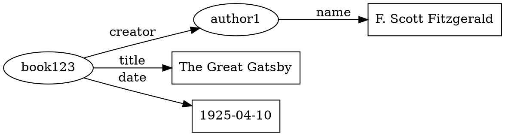
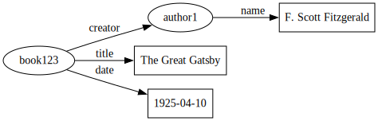

To visualize a **Tripl** document with **Graphviz**, you can represent the RDF triples as a directed graph. Each triple `[subject, predicate, object]` becomes an edge in the graph, where:

- **Subject** is a node.
- **Predicate** is the label of the directed edge.
- **Object** is either another node (if it is a URI) or a value displayed as a literal.

### Technical Overview of Representation

#### Nodes
1. **URIs**: Represented as graph nodes with a unique identifier. For example, `book123` resolves to `http://example.com/book123` and is displayed as a node labeled `book123`.
2. **Literals**: Represented as leaf nodes (rectangles or ellipses, depending on styling) with their value as the label.

#### Edges
1. **Predicates**: Represented as directed edges between the **subject** and **object** nodes. The edge label corresponds to the resolved predicate (e.g., `dc:title`).
2. **Types of Relationships**:
   - **SameAs relationships** (e.g., `owl:sameAs`) are visually represented as bidirectional edges or dashed edges to indicate equivalence.
   - Other predicates are standard directed edges.

#### Graphviz Syntax
1. **Graph Declaration**: Use `digraph` for a directed graph.
2. **Node Declaration**:
   - Use unique identifiers for each node.
   - Apply optional styling (e.g., `shape=ellipse` for URIs, `shape=box` for literals).
3. **Edge Declaration**:
   - Each edge connects a `subject` to an `object` with the `predicate` as the edge label.

---

### Example Graphviz Representation

#### Input Tripl Document
```plaintext
@base http://example.com/

[book123, title, "The Great Gatsby"]
[book123, creator, author1]
[author1, name, "F. Scott Fitzgerald"]
[book123, date, "1925-04-10"]
```

#### Graphviz Output


##### Rendered




#### Visualization Breakdown
1. **Nodes**:
   - `book123` and `author1` are represented as elliptical nodes.
   - Literals (`"The Great Gatsby"`, `"F. Scott Fitzgerald"`, and `"1925-04-10"`) are represented as rectangular nodes.

2. **Edges**:
   - Directed edges from `book123` to the literals or `author1` with labels like `title`, `creator`, and `date`.
   - Directed edges from `author1` to `"F. Scott Fitzgerald"` with the label `name`.

3. **Styling**:
   - **Node Shapes**:
     - URIs: Ellipses.
     - Literals: Boxes.
   - **Edge Labels**: Show predicates in a readable manner.

---

### Advanced Representations

#### Equivalence (e.g., `owl:sameAs`)
For triples like `[book123, sameAs, book456]`:
```dot
book123 -> book456 [label="sameAs", dir="both", style="dashed"];
```

#### Data Type Properties
For properties with specific data types (e.g., `xsd:date` for `"1925-04-10"`):
```dot
literal3 [label="1925-04-10 (xsd:date)", shape=box];
```

#### Clustering
To group related entities, use **Graphviz subgraphs**:
```dot
subgraph cluster_books {
    label="Books";
    style=dotted;

    book123;
    literal1;
    literal3;
}
```

---

### Automation with Graphviz Tools
- **Preprocessing**: Write a script (in Python or another language) to parse the **Tripl** document, resolve mappings, and output Graphviz-compatible `.dot` files.
- **Visualization**: Use Graphviz tools like `dot` or `neato` to generate visualizations:
  - `dot -Tpng graph.dot -o graph.png` (for PNG output)
  - `dot -Tsvg graph.dot -o graph.svg` (for scalable vector graphics)

This process yields a clear and human-readable representation of the **Tripl** document.
